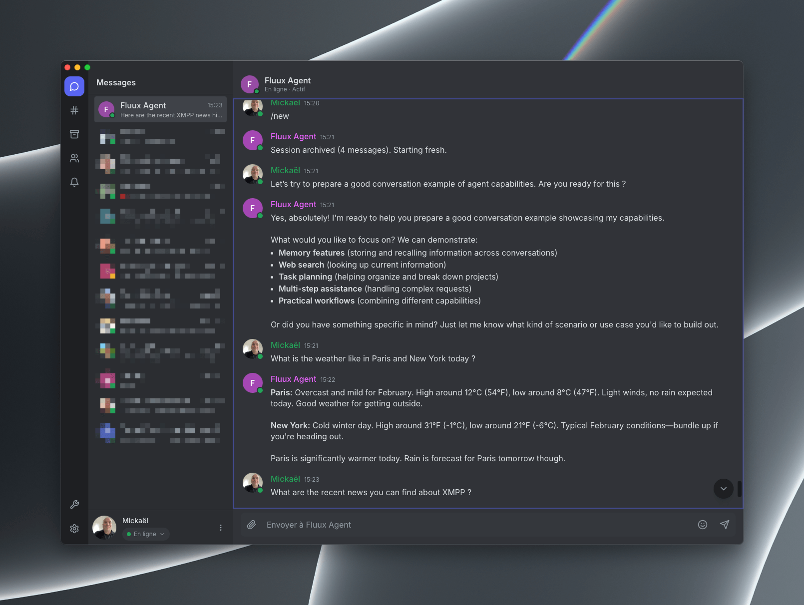

# Fluux Agent

A framework for open and federated AI agent networks built on XMPP, with security as a first-class concern.

[](https://github.com/processone/fluux-agent/releases)
[](https://github.com/processone/fluux-agent/releases)
[](https://github.com/processone/fluux-agent/releases)
[](https://github.com/processone/fluux-agent/actions)
[](CONTRIBUTING.md)

Fluux Agent is the foundation for a new kind of AI infrastructure: autonomous agents that communicate over an open, federated protocol instead of closed APIs. Today it is a single-agent runtime that connects to any XMPP server. Tomorrow it becomes a network where your agent can talk to mine, across domains and organizations, without a centralized platform controlling the exchange.

This is the beginning. The runtime you see here (XMPP connectivity, conversational memory, LLM integration) is the first building block. The roadmap leads to a skills system, sandboxed execution, an agent-to-agent protocol, and ultimately federation: agents on different servers discovering each other, delegating tasks, and collaborating over standard XMPP infrastructure that has been battle-tested for more than 20 years.

## Table of Contents

- [Screenshots](#screenshots)
- [Why](#why)
- [Architecture](#architecture)
- [Roadmap](#roadmap)
- [Quick Start](#quick-start)
- [Configuration](#configuration)
- [Multi-User Chat (MUC)](#multi-user-chat-muc)
- [Fluux Agent vs OpenClaw](#fluux-agent-vs-openclaw)
- [License](#license)

## Screenshots

<div align="center">

*Click on any screenshot to view full size*

| Fluux Agent in CLI | Connect with Fluux Messenger |
|--------------------|------------------------------|
| <a href="assets/readme/cli-agent.png"></a> | <a href="assets/readme/connect-fluux-messenger.png"></a> |
| *Clean and minimal CLI agent* | Connect with [Fluux Messenger](https://github.com/processone/fluux-messenger) (or any XMPP client) |

</div>

## Why

OpenClaw demonstrated the demand for personal AI assistants that actually act. But its architecture (Node.js bridges to every messaging platform, root system access, JSON file storage) creates serious security, reliability, and interoperability issues. More importantly, it is a closed system: agents cannot talk to each other, and every integration is a bespoke bridge the project must maintain.

The AI agent ecosystem needs what email gave us for messages and the web gave us for documents: an open protocol where any agent can reach any other agent, regardless of who hosts it.

XMPP already solves this problem. It provides reliable message routing, authentication, presence, PubSub for events, message archives (MAM), multi-device synchronization, and federation. It has been doing this at Internet scale for decades. The protocol is extensible by design, and adding agent-specific semantics such as skill discovery, task delegation, or action confirmation fits naturally into the XMPP extension model.

Fluux Agent connects modern AI agents to this proven messaging backbone.

## Architecture

```
┌─────────────────────────────────────────────────────┐
│                   XMPP Server                       │
│         (ejabberd, Prosody, Openfire...)            │
│                                                     │
│  Routing · Presence · PubSub · MAM · Federation     │
└────────────────────┬────────────────────────────────┘
                     │ XEP-0114 or C2S (SASL + STARTTLS)
                     │
┌────────────────────▼────────────────────────────────┐
│                  Fluux Agent                        │
│              (standalone Rust binary)               │
│                                                     │
│  ┌─────────────┐ ┌──────────────┐ ┌──────────────┐  │
│  │    XMPP     │ │    Agent     │ │     LLM      │  │
│  │  Component  │ │   Runtime    │ │   Client     │  │
│  │  or C2S     │ │  (agentic    │ │  (Claude,    │  │
│  │  Client     │ │   loop)      │ │  Ollama...)  │  │
│  └─────────────┘ └──────────────┘ └──────────────┘  │
│                                                     │
│  ┌─────────────┐ ┌──────────────┐ ┌──────────────┐  │
│  │   Skills    │ │   Memory     │ │   Sandbox    │  │
│  │  Registry   │ │  (Markdown / │ │  (Wasm +     │  │
│  │  + Builtin  │ │   PEP)       │ │  Landlock)   │  │
│  └─────────────┘ └──────────────┘ └──────────────┘  │
└─────────────────────────────────────────────────────┘
```

### Project Structure

```
fluux-agent/
├── src/
│   ├── main.rs                 # Entry point, config loading
│   ├── config.rs               # TOML deserialization + ConnectionMode enum
│   ├── xmpp/
│   │   ├── mod.rs              # Connection factory (dispatches component/client)
│   │   ├── component.rs        # XEP-0114 connection, SHA-1 handshake
│   │   ├── client.rs           # C2S connection (STARTTLS + SASL + bind)
│   │   ├── sasl.rs             # SASL PLAIN + SCRAM-SHA-1 (RFC 5802)
│   │   └── stanzas.rs          # Stanza parsing/construction
│   ├── agent/
│   │   ├── mod.rs
│   │   ├── runtime.rs          # Main agentic loop
│   │   └── memory.rs           # Conversational memory (markdown files)
│   ├── llm/
│   │   ├── mod.rs
│   │   ├── client.rs           # LlmClient trait (provider abstraction)
│   │   ├── anthropic.rs        # Anthropic Claude API client
│   │   └── ollama.rs           # Ollama local model client
│   ├── skills/
│   │   ├── mod.rs
│   │   ├── registry.rs         # Skill discovery and loading
│   │   └── builtin/
│   │       ├── mod.rs
│   │       └── web_search/     # Web search skill (Tavily + Perplexity)
│   └── sandbox/
│       └── mod.rs              # Stub for v0.4 (Wasm + Landlock)
├── data/memory/                # Agent memory (workspace files + per-JID dirs)
├── config/
│   └── agent.example.toml
├── Cargo.toml
├── LICENSE                     # Apache 2.0
└── README.md
```

### Key Principles

- **Open and federated**  
  Agents communicate over XMPP, an open standard with native federation. No vendor lock-in, no centralized platform. Your agent, your server, your rules.

- **Total decoupling**  
  The agent is a standard XMPP component. It works with any XMPP server, not just ejabberd.

- **Designed for teams**  
  Each user has an isolated conversation context and memory, while shared skills and procedures remain accessible to everyone. One agent instance can serve an entire team without mixing personal data.

- **Security by design**  
  Defense in depth across multiple layers: declarative capabilities, action validation, a Wasm sandbox, kernel sandboxing (Landlock or seccomp), and process isolation. The LLM never touches the system directly.

- **No public endpoint required**  
  XMPP acts as the inbound transport. The agent can run on a laptop or private network and still be reachable, without exposing webhooks or firewall ports.

- **Enterprise control layer**  
  XMPP plus Fluux Agent forms an AI gateway. The server can filter traffic, detect prompt injection attempts, and control model selection or cost centrally.

- **Proactivity**  
  Cron jobs, PubSub subscriptions, and webhooks allow the agent to initiate conversations, not just reply.

- **Federation**  
  An agent on `domain-a.com` can talk to another on `domain-b.com` through standard XMPP federation.

- **Human-in-the-loop collaboration**  
  Fluux Agent is designed to support collaboration, not replace judgment. Destructive actions require confirmation, and skills can be implemented by humans as well as machines.

## Roadmap

Fluux Agent starts as a personal assistant, but it is built from day one to evolve into a federated network of collaborating agents. XMPP already handles routing, presence, authentication, encryption, and federation. Fluux Agent adds AI semantics on top.

- v0.1 is tagged and stable. It includes dual XMPP connection modes (component and C2S), an agentic loop, Claude integration, JSONL session memory, slash commands, and MUC support.

- v0.2 is in progress and focuses on the skills system, Ollama support, and model abstraction. See the [Roadmap](ROADMAP.md) for details.

### Short term

| Phase    | Description                                                                                                                        | Status         |
|----------|------------------------------------------------------------------------------------------------------------------------------------|----------------|
| **v0.1** | XMPP component + C2S client + agentic loop + Claude API + JSONL memory + sessions + slash commands + MUC rooms                     | Tagged         |
| **v0.2** | Skills system (web search), LlmClient trait, Ollama support, model tiering, proactive context learning, prompt injection detection | In progress    |
| **v0.3** | Proactivity (cron via PubSub, heartbeat), advanced MUC (room-specific prompts, invite handling)                                    | Planned        |
| **v0.4** | Wasm sandbox (wasmtime) + Landlock                                                                                                 | Planned        |
| **v0.5** | Agent protocol (`urn:fluux:agent:0`): discovery, execute, confirm                                                                | Planned        |
| **v1.0** | Agent-to-agent federation, complete documentation                                                                                  | Planned        |

### Long term

```
Today (v0.1)                         Tomorrow (v1.0)

 User ↔ Agent ↔ LLM                  User ↔ Agent A ↔ Agent B ↔ Agent C
                                              │            │
                                          domain-a.com  domain-b.com
                                              │            │
                                          ┌───┴────────────┴───┐
                                          │  XMPP Federation   │
                                          │  (open, standard)  │
                                          └────────────────────┘
```

## Quick Start

### Prerequisites

- Rust 1.75 or newer
- An XMPP server (ejabberd, Prosody, Openfire)
- An LLM backend:
  - Ollama for local or offline deployments
  - Anthropic (Claude) for hosted models

Two connection modes are available:

- **Client mode (C2S)**  
The agent connects as a regular XMPP user. This requires no server configuration beyond creating an account and is ideal for individuals or small teams.

- **Component mode (XEP-0114)**  
The agent registers as a subdomain. This requires server configuration but provides better isolation and is the preferred setup for production environments.

### ejabberd Configuration (component mode)

```yaml
listen:
  -
    port: 5275
    module: ejabberd_service
    access: all
    hosts:
      "agent.localhost":
        password: "secret"
```

### Launch

```bash
cp config/agent.example.toml config/agent.toml
# Edit config/agent.toml with your settings

# With Anthropic (cloud):
export ANTHROPIC_API_KEY="sk-ant-..."

# With Ollama (local, no API key needed):
# Set provider = "ollama" and model = "llama3.2" in config/agent.toml
# Make sure Ollama is running: ollama serve

export AGENT_SECRET="secret"       # component mode
# or: export BOT_PASSWORD="pass"   # client mode

cargo run
```

Then, send a message to `agent.localhost` (component mode) or `bot@localhost` (client mode) from any XMPP client.

## Configuration

### Component Mode

```toml
[server]
host = "localhost"
port = 5275
mode = "component"
component_domain = "agent.localhost"
component_secret = "${AGENT_SECRET}"
```

### Client Mode (C2S)

```toml
[server]
host = "localhost"
port = 5222
mode = "client"
jid = "bot@localhost"
password = "${BOT_PASSWORD}"
resource = "fluux-agent"
tls_verify = false  # for self-signed certs (dev)
```

### LLM Configuration

Anthropic (cloud):

```toml
[llm]
provider = "anthropic"
model = "claude-sonnet-4-5-20250929"
api_key = "${ANTHROPIC_API_KEY}"
max_tokens_per_request = 4096
```

Ollama (local):

```toml
[llm]
provider = "ollama"
model = "llama3.2"
host = "http://localhost:11434"   # optional, this is the default
max_tokens_per_request = 4096
```

No API key is required for Ollama, just install [Ollama](https://ollama.com), pull a model (`ollama pull llama3.2`), and point the agent at it. This enables fully private, offline deployments with no cloud dependency.

### Common Configuration

```toml
[agent]
name = "Fluux Agent"
allowed_jids = ["admin@localhost"]

[memory]
backend = "markdown"
path = "./data/memory"

[session]
idle_timeout_mins = 240   # Auto-archive after 4 hours of inactivity (0 = disabled)
```

Memory is stored as human-readable markdown files, workspace files for global agent configuration and per-JID directories for isolated user data. This makes agent memory inspectable, editable, and git-friendly. Admins can customize agent behavior by creating `instructions.md`, `identity.md`, and `personality.md` in the memory root directory.

## Commands

Messages starting with `/` are intercepted by the runtime and never reach the LLM. They cost zero API calls and respond instantly.

| Command            | Description                                                               |
|--------------------|---------------------------------------------------------------------------|
| `/new` or `/reset` | Archive the current conversation and start a fresh session                |
| `/forget`          | Erase your history, profile, and memory (archived sessions are preserved) |
| `/status`          | Agent uptime, connection mode, LLM model, session stats                   |
| `/ping`            | Check if the agent is alive                                               |
| `/help`            | List available commands                                                   |

## Session Management

Each user has a current conversation session (`history.jsonl`) and optionally archived past sessions stored in JSONL format. This prevents context from growing unboundedly and lets users start fresh when changing topics.

- **`/new`** archives the current session to `sessions/{YYYYMMDD-HHMMSS}.jsonl` and clears the LLM context.
- **`/forget`** erases the current history, user profile (`user.md`), and memory (`memory.md`) but preserves archived sessions.
- **`/status`** shows the number of messages in the current session and how many sessions have been archived.
- **Session timeout** — idle sessions are automatically archived when the next message arrives after a configurable inactivity period. This is lazy (no background timer) and works per-user and per-room.

Memory layout:

```
data/memory/
├── instructions.md              # Global: agent behavior rules
├── identity.md                  # Global: agent name, personality, background
├── personality.md               # Global: tone, style, quirks
├── {jid}/
│   ├── user.md                  # What the agent knows about this user
│   ├── memory.md                # Long-term notes about this user
│   ├── history.jsonl            # Current session (JSONL)
│   └── sessions/
│       ├── 20250601-143022.jsonl  # Archived session
│       └── 20250602-091500.jsonl  # Another archived session
```

Global workspace files (`instructions.md`, `identity.md`, `personality.md`) are shared across all users and let admins customize the agent without touching code. When no workspace files exist, a built-in default prompt is used. Per-JID directories are strictly isolated, each user (or room) has their own `user.md`, `memory.md`, and conversation history.

See [`data/memory/README.md`](data/memory/README.md) for the full workspace reference, file format details, and OpenClaw migration guide.

## Multi-User Chat (MUC)

Fluux Agent can join XMPP group chat rooms (XEP-0045) and respond when mentioned.

### Configuration

```toml
[[rooms]]
jid = "lobby@conference.localhost"
nick = "FluuxBot"

[[rooms]]
jid = "dev@conference.localhost"
nick = "FluuxBot"
```

The agent joins configured rooms on connect. It records all room messages for context and responds when its nickname is mentioned (e.g., `@FluuxBot what's the status?` or `FluuxBot: hello`). This means the LLM sees the full conversation when it's asked a question, not just the mention.

Each room has its own isolated memory directory, just like 1:1 conversations, the room JID is used as the memory key. All participants in the same room share conversation context.

### Per-room identity

You can give the agent a different persona per room (or per user) by placing workspace files in the JID's memory directory. These override the global files:

```
data/memory/
  identity.md                              # Global: "I am Fluux Agent"
  instructions.md                          # Global rules
  lobby@conference.localhost/
    instructions.md                        # Room override: "You are a support bot..."
  dev@conference.localhost/
    identity.md                            # Room override: "I am DevBot"
    personality.md                         # Room override: "Terse, technical"
```

The lookup order is: **per-JID file → global file → none**. If a per-JID file exists and is non-empty, it wins. Otherwise the global file is used. This works for rooms *and* individual users: no config changes needed, just drop files into the directory.

## Agent Protocol (draft)

Fluux Agent introduces an experimental XMPP namespace `urn:fluux:agent:0` for structured communication between humans and agents:

```xml
<!-- Skill discovery -->
<iq type='get' to='agent.example.com'>
  <query xmlns='urn:fluux:agent:0#skills'/>
</iq>

<!-- Skill execution -->
<iq type='set' to='agent.example.com'>
  <execute xmlns='urn:fluux:agent:0#execute' skill='email-summary'>
    <param name='max_emails'>20</param>
  </execute>
</iq>

<!-- Confirmation request (destructive action) -->
<message from='agent.example.com' to='user@example.com'>
  <body>Send this email to Platform24? (reply yes/no)</body>
  <confirm xmlns='urn:fluux:agent:0#confirm' id='action-7742'>
    <action type='send-email'/>
    <expires>2026-02-08T19:00:00Z</expires>
  </confirm>
</message>
```

## Fluux Agent vs OpenClaw

Fluux Agent is not an OpenClaw rewrite in Rust. It follows a different architectural model.

OpenClaw treats connections to messaging platforms as a core responsibility of the agent, with dedicated bridges for Slack, Discord, Telegram, WhatsApp, and others. This results in a growing set of protocol adapters that must be maintained individually, each with its own limitations, rate limits, and failure modes.

Fluux Agent takes the opposite approach. The agent speaks a single native protocol: **XMPP**, along with its mature extension ecosystem for presence, PubSub, message archives, federation, and end-to-end encryption. Interaction with external platforms is handled as *skills*, not transport layers.

Sending a Telegram message, posting to Slack, or forwarding to Discord are actions the agent performs, similar to sending an email or calling an API. They are not part of the core connectivity model.

This separation is intentional:

- **Bot protocols are connection modes**  
  They define how the agent receives instructions (XMPP component, XMPP C2S, and potentially Matrix or IRC in the future).

- **Messaging platforms are skills**  
  They define how the agent acts on the world (posting messages, forwarding content, triggering workflows).

The result is a simpler, more robust architecture that builds on decades of proven messaging infrastructure instead of relying on fragile, platform-specific bridges.

## License

The core of Fluux Agent is released under the [Apache License 2.0](LICENSE).

Enterprise-oriented features (multi-agent federation, multi-tenancy, audit logging, SSO) will be released under the Business Source License (BSL) 1.1, with automatic conversion to Apache 2.0 after four years.

## Star History

[](https://star-history.com/#processone/fluux-agent&Date&legend=bottom-right)

---

<div align="center">

Built with ❤️ by [ProcessOne](https://www.process-one.net), the team behind [ejabberd](https://www.ejabberd.im). Fluux Agent builds on that experience to provide an open foundation for federated AI agent networks. 

</div>
