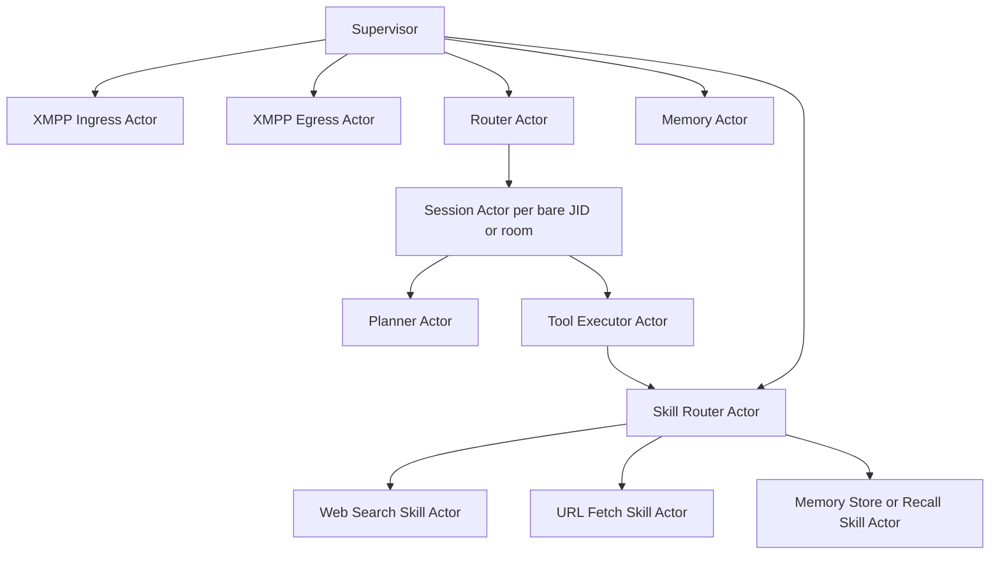

# Actor Runtime Design

Status: Implemented (Phase E complete)  
Project: Fluux Agent  
Last updated: 2026-02-21

## 1. Context

Fluux Agent historically ran with a single runtime loop that handled transport, authorization, command routing, planning, tool calls, memory persistence, and response emission in one control path.

The actor migration is now complete in the startup path, and this document serves both as architecture reference and migration record.

The single-loop design worked for v0.x but created scaling and reliability pressure as soon as we add:

- More skills
- Subagents
- Cross-agent delegation
- Long-running workflows
- Strong isolation between conversations

This document proposes an actor-oriented runtime architecture for Fluux Agent, while preserving the existing XMPP transport and memory model.
XMPP is treated as an external boundary (users and remote agents), while internal coordination stays on typed in-process actor messages.

## 2. Goals

- Isolate failures so one conversation or skill does not impact all others.
- Guarantee per-conversation ordering.
- Make backpressure explicit with bounded mailboxes.
- Keep XMPP transport as a stable boundary.
- Use XMPP only at the boundary (user and remote-agent I/O), not as the internal actor bus.
- Prepare for subagents and agent-to-agent delegation.
- Migrate incrementally without a flag day rewrite.

## 3. Non-goals

- Replacing Tokio with a custom scheduler.
- Immediate distributed clustering (single-process first).
- Changing session file format in this migration.
- Reintroducing monolithic orchestration.
- Using XMPP stanza flows for in-process actor-to-actor communication.

## 4. Current Runtime Snapshot

Main orchestration runs through:

- `src/main.rs`
- `src/actors/supervisor.rs`
- `src/actors/router.rs`
- `src/actors/session.rs`

Runtime dependency assembly lives in:

- `src/agent/runtime.rs`

Skills are registered at startup and dispatched through the actor pipeline:

- `src/skills/mod.rs`
- `src/skills/registry.rs`
- `src/skills/builtin/*`

Transport boundary remains stable in:

- `src/xmpp/component.rs`
- `src/xmpp/client.rs`

## 5. Target Actor Topology



### 5.1 Boundary Model (External XMPP, Internal Actors)

- External boundary: XMPP handles user traffic and remote agent federation traffic only.
- Internal runtime: actors communicate with typed envelopes over in-process channels.
- `XmppIngressActor` is the protocol adapter in: stanza/event -> validated internal envelope.
- `XmppEgressActor` is the protocol adapter out: internal outbound intent -> XMPP command/stanza.
- No internal actor emits raw stanza semantics directly; all outbound chat/presence flows through egress.
- This keeps internal contracts transport-agnostic so additional edge transports can be added later without changing core actor APIs.

## 6. Actor Responsibilities

### Supervisor

- Owns actor lifecycles and restart policies.
- Applies bounded restart backoff.
- Emits health events.

### XMPP Ingress Actor

- Consumes `XmppEvent`.
- Normalizes events into internal envelopes.
- Performs early validation (domain/JID allow checks can stay here or in router).
- Terminates protocol concerns at the boundary; downstream actors must not depend on stanza-specific structures.

### Router Actor

- Maps envelope to `conversation_id`.
- Creates or reuses per-conversation `SessionActor`.
- Enforces maximum active session actors.
- Remains transport-agnostic (routing logic does not depend on XMPP stanza details).

### Session Actor (per conversation)

- The serialization point for one conversation.
- Guarantees message ordering.
- Owns local conversation state (short-lived runtime state only).
- Delegates planning and tool execution; does not directly perform side effects.

### Planner Actor

- Builds system prompt + conversation messages.
- Calls `LlmClient::complete()`.
- Produces either final answer or tool plan.

### Tool Executor Actor

- Runs the tool-use loop with strict limits:
  - max rounds
  - per-tool timeout
  - per-turn budget
- Requests execution through Skill Router.

### Skill Router Actor

- Resolves a skill by name.
- Applies capability check/policy.
- Dispatches to concrete skill actor.

### Skill Actors

- One side-effect domain per actor (web, files, memory, etc.).
- Can be supervised independently and rate-limited independently.
- If a skill needs to send chat output, it returns an internal intent that is delivered through `XmppEgressActor`.

### Memory Actor

- Serializes writes and optional read caching.
- Keeps current JSONL API behavior.
- Provides stable ordering for history/session mutations.
- Starts with a single-writer lane for correctness; can scale to hash-sharded writers by `conversation_id`.
- Supports bounded write micro-batching to reduce fsync pressure without reordering per conversation.

### XMPP Egress Actor

- Owns outbound `XmppCommand` channel.
- Enforces outbound rate limits and delivery retries where appropriate.
- Is the only actor allowed to translate internal intents into XMPP sends/presence updates.

## 7. Message Contracts

Use explicit internal envelopes:

```rust
pub struct Envelope {
    pub conversation_id: String,   // bare JID or room JID
    pub correlation_id: String,    // UUID
    pub received_at_ms: i64,
    pub payload: Payload,
}

pub enum Payload {
    UserMessage { body: String, msg_id: Option<String>, oob: Vec<OobData> },
    Reaction { message_id: String, emojis: Vec<String> },
    Presence { kind: PresenceType },
    SlashCommand { raw: String },
}
```

Internal replies should include `correlation_id` for tracing and auditing.
Internal message contracts should stay transport-neutral and must not embed raw stanza XML.

### 7.1 Delivery and Idempotency Semantics (MVP)

Define baseline semantics explicitly to prevent accidental behavior drift:

- Internal actor sends are at-most-once (enqueue once or fail).
- Router/session actors do not retry blindly on enqueue failure; they return explicit overload/busy outcomes.
- XMPP ingress de-duplicates inbound stanzas when `msg_id` is present, using key `(conversation_id, msg_id)` with TTL.
- If `msg_id` is absent, deduplication is best-effort only and not guaranteed across process restarts.
- Side-effecting requests (skill execution, memory mutation, outbound send) must carry `idempotency_key = correlation_id`.
- Side-effecting actors maintain bounded recent-key caches and drop duplicate `idempotency_key` requests.
- Retries are permitted only at boundary actors (egress, external API clients) and must reuse the same `idempotency_key`.

## 8. Supervision Model

Recommended policy:

- `one_for_one` restart semantics for skill actors and session actors.
- Router and egress actors are high-priority and restarted first.
- Backoff with jitter for crash loops.
- Escalate to process-level reconnect only for transport boundary failures.

## 9. Ordering, Concurrency, Backpressure

- Per-conversation ordering: exactly one `SessionActor` mailbox per conversation.
- Cross-conversation parallelism: multiple session actors run concurrently.
- Global pressure controls:
  - bounded router mailbox
  - bounded per-session mailbox
  - bounded per-skill concurrency
- On overload, return explicit "busy, retry" behavior instead of unbounded queue growth.

### 9.1 Overflow Policy Matrix (MVP)

- Router mailbox full: reject newest envelope, increment overflow metric, return deterministic busy response when possible.
- Session mailbox full: apply `reject_new` for that conversation, preserve already-enqueued ordering.
- Skill router concurrency exhausted: wait up to queue timeout, then return tool error class `timeout`.
- Memory actor mailbox full: wait up to enqueue timeout, then fail fast with `memory_busy`.
- XMPP egress mailbox full: bounded enqueue retries; if exhausted, emit dead-letter event with reason and `correlation_id`.

### 9.2 Busy Response Contract

When overload occurs, the runtime sends a deterministic non-LLM response:

- `System busy. Please retry in {busy_retry_after_secs}s. (ref: {correlation_id})`

This keeps overload behavior auditable and avoids spending model tokens on congestion responses.

## 10. Skills Integration Changes

Current `Skill` trait can remain for now. Wrap trait objects in actor adapters.

Near-term changes:

- Keep `SkillRegistry` for definitions visible to the LLM.
- Replace direct `skill.execute()` from runtime loop with `SkillRouterActor` dispatch.
- Add standardized result envelope:
  - success text
  - error class (`timeout`, `policy_denied`, `execution_error`)

This allows future Wasm/MCP isolation without changing planner contracts.

## 11. Security and Policy Hooks

Policy checks should happen before side effects:

- Capability allowlist per skill.
- Domain/JID authorization before dispatch.
- URL and file access guardrails centralized in skill actors.
- Optional confirmation workflow for destructive actions.

Actor boundaries provide clean choke points for auditing and deny-by-default behavior.

## 12. Config Additions

Add a dedicated section in `config.rs` and TOML:

```toml
[actors]
enabled = true
router_mailbox = 1024
session_mailbox = 256
max_active_sessions = 2000
session_idle_ttl_secs = 1800
busy_retry_after_secs = 5
dedupe_ttl_secs = 600
dead_letter_path = "data/dead_letters.jsonl"

[actors.tooling]
max_tool_rounds = 10
skill_timeout_secs = 30
max_parallel_skills = 32
skill_queue_timeout_ms = 5000

[actors.supervision]
restart_backoff_min_ms = 200
restart_backoff_max_ms = 10000
max_restarts_per_minute = 60

[actors.memory]
enqueue_timeout_ms = 200
writer_shards = 1
write_batch_max = 32
write_batch_max_delay_ms = 20

[actors.observability]
metrics_enabled = true
queue_depth_export_interval_secs = 5
slow_actor_warn_ms = 200
```

`actors.enabled` is kept for backward-compatibility but ignored at runtime.

## 13. Incremental Migration Status

### Phase A: Boundaries first (completed)

- Introduce supervisor, ingress, egress, and router actors.
- Kept existing runtime logic behind one session worker actor during transition.

Outcome: topology in place, low behavioral change.

### Phase B: Per-conversation session actors (completed)

- Route by bare JID/room JID.
- Enforce per-conversation mailbox ordering.

Outcome: isolation between conversations.

### Phase C: Tool executor split (completed)

- Extract agentic tool loop from runtime into `ToolExecutorActor`.
- Add strict timeout and budget controls.

Outcome: tool failures isolated and measurable.

### Phase D: Skill actors (completed)

- Convert builtins to skill actors via router.
- Add policy and capability checks at router boundary.

Outcome: side-effect isolation and better security posture.

### Phase E: Retire legacy runtime path (completed)

- Direct monolithic orchestration removed after parity stabilization.

Outcome: actor runtime becomes default.

## 14. File-Level Change Map

Add:

- `src/actors/mod.rs`
- `src/actors/types.rs`
- `src/actors/supervisor.rs`
- `src/actors/xmpp_ingress.rs`
- `src/actors/xmpp_egress.rs`
- `src/actors/router.rs`
- `src/actors/session.rs`
- `src/actors/planner.rs`
- `src/actors/tool_executor.rs`
- `src/actors/skill_router.rs`
- `src/actors/memory_actor.rs`

Update:

- `src/main.rs` (bootstrap and wiring)
- `src/config.rs` (actors config)
- `src/agent/runtime.rs` (actor dependency assembly for startup/tests)
- `src/skills/registry.rs` (dispatch indirection)

Likely unchanged in early phases:

- `src/xmpp/component.rs`
- `src/xmpp/client.rs`
- `src/agent/memory.rs` storage format

## 15. Testing Strategy

- Unit tests for message contracts and routing decisions.
- Property tests for per-conversation ordering.
- Replay tests for duplicate ingress events (`msg_id` reused) to verify idempotent side effects.
- Failure injection tests:
  - skill timeout
  - actor panic/restart
  - XMPP disconnect/reconnect
- Overflow contract tests:
  - router/session mailbox saturation
  - deterministic busy response
  - dead-letter emission on egress exhaustion
- Boundary translation tests:
  - ingress stanza -> internal envelope mapping and authorization
  - internal outbound intent -> egress stanza/command mapping
- Deterministic actor fixture regression suite for chat/presence/reaction/tool flows.
- Compatibility tests for legacy dead-letter records and replay behavior.
- Load tests for mailbox saturation and bounded latency.

### 15.1 Mandatory Observability Baseline

Required metrics:

- Gauges: mailbox depth per actor.
- Counters: enqueue/dequeue, overflow, dead-letter, restart, busy-response.
- Histograms: actor handle latency, skill execution latency, memory write latency, end-to-end turn latency.

Required tracing/logging:

- Root span keyed by `correlation_id` with child spans across ingress -> router -> session -> planner/tool -> egress.
- Structured error logs must include `conversation_id`, `correlation_id`, actor, and failure class.

Initial alerts:

- Any sustained dead-letter or overflow rate above zero for 5 minutes.
- Restart loops breaching `max_restarts_per_minute`.
- p95 end-to-end latency breaching operator-defined SLO.

## 16. Risks and Mitigations

Risk: more moving parts and protocol complexity.  
Mitigation: explicit typed contracts, tracing correlation IDs, strict module boundaries.

Risk: behavior drift during migration.  
Mitigation: fixture-based actor regression tests and staged rollout validation.

Risk: dead letters or dropped messages under pressure.  
Mitigation: bounded queues with explicit overflow policy and telemetry.

Risk: memory actor becomes a throughput hotspot.  
Mitigation: start with single-writer semantics, then scale with hash-sharded writers and bounded write batching while preserving per-conversation ordering.

Risk: observability gaps hide overload until user-visible failures.  
Mitigation: enforce mandatory metrics/tracing and alerting in phase A before feature rollout.

## 17. Expected Outcomes

If implemented incrementally, actorization should provide:

- Better resilience under partial failures
- Cleaner security boundaries around skills
- Higher concurrency without losing per-user ordering
- A practical path to subagents and federation-oriented workflows
